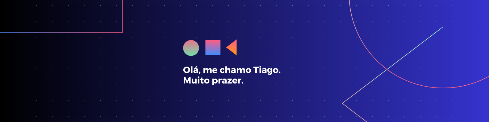

## 🙋  Olá! Me chamo Tiago

### 👨🏻‍💻 Sobre mim

📖   Eu gosto de estudar de tudo um pouco.\
📠  Sou técnico em informática e ex-estudante de Engenharia Mecânica. \
📚   Temas que tenho enteresse: matemática, computação, engenharia, ciência e tecnologia. \
🌱   Estou sempre buscando aprender novos assuntos e tecnologias.\
✍🏻   Assuntos que tenho me enteressado ultimamente: programação, ciência de dados, aprendizado de máquina. \
🸠  No meu tempo livre eu gosto de tocar violão.

### 🛠   Algumas tecnologias que já utilizei

 
 
 
 \
 
 
 
 
\
 
 
 
 
\
 
 
\
 
 

### 🚀   Análise sobre o meu Github

### 📌 &nbsp; Minhas redes e contato

